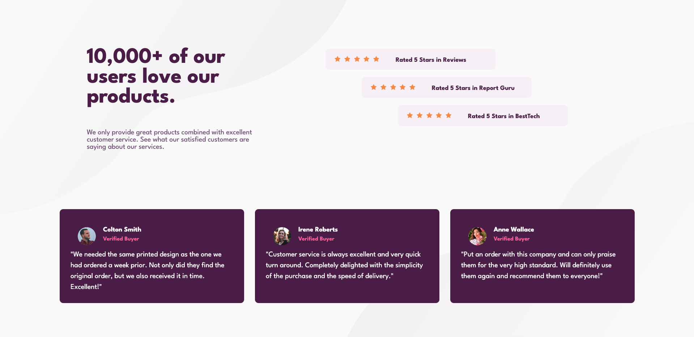

# Frontend Mentor - Social proof section solution

This is our solution to the [Social proof section challenge on Frontend Mentor](https://www.frontendmentor.io/challenges/social-proof-section-6e0qTv_bA).

## Table of contents

- [Overview](#overview)
  - [The challenge](#the-challenge)
  - [Screenshot](#screenshot)
  - [Links](#links)
- [My process](#my-process)
  - [Built with](#built-with)
  - [What I learned](#what-i-learned)
  - [Continued development](#continued-development)
  - [Useful resources](#useful-resources)
- [Author](#author)
- [Acknowledgments](#acknowledgments)

## Overview
        
        This is a simple social proof section. We've used flexbox to make it responsive. We've also used a few media queries to make it responsive for mobile devices.

### The challenge

Users should be able to:

- View the optimal layout for the section depending on their device's screen size

### Screenshot




### Links

- Solution URL: [https://github.com/UbaidRussell/social-proof-section](https://github.com/UbaidRussell/social-proof-section)
- Live Site URL: [https://ubaidrussell.com/social-proof-section/](https://ubaidrussell.com/social-proof-section/)

## My process

### Built with

- Semantic HTML5 markup
- CSS custom properties
- Flexbox

### What I learned

    We've been working on accessibility so this code is a bit different from the original. We've added a few aria attributes and a few roles to make the site more accessible.
```html
    <div role="presentation" class="rating-section-part-one">
```

### Continued development
    We'll keep building cool websites

### Useful resources

- [Example resource 1](https://stackoverflow.com/questions/13637106/what-are-the-best-width-ranges-for-media-queries) -  This helped me for media queries. I really liked this pattern and will use it going forward.

- [Example resource 2]() - Nothing yet

## Author

- Website - [UbaidRussell](https://www.ubaidrussell.com)
- Frontend Mentor - [@UbaidRussell](https://www.frontendmentor.io/profile/UbaidRussell)
- Twitter - [@UbaidRussell](https://www.twitter.com/UbaidRussell)

## Acknowledgments
    
        Thanks to Frontend Mentor for providing us with such a great platform to practice our skills.